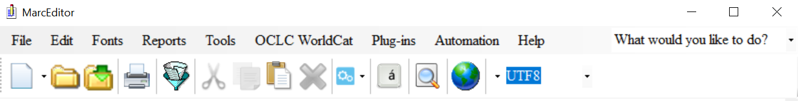

# The MarcEditor
The MarcEditor is a discreet utility within MarcEdit that enables you to work with your MARC data in an easily human and machine readable format.

# MarcEditor Top Level Menu
The MarcEditor has a robust set of features available via the top level menu. Features can be accessed through the menu or through shortcut keys. The shortcut key for a feature appears next to it in the menu.

## MarcEditor Top Level Menu Features
Each top level menu heading contains so many gems. Below are some highlights of those features that are frequently used when working with a set of MARC data.

File
* Save, Save As, Open, Recent: This is where you'll find those important functions of saving, saving as, opening up a recent file, or opening a new file.
* Select Records for Edit: This is where you can select a subset of your data to work with.
* Compile File: This is the same function as MarcMaker, meaning that the readable MARC data file (.mrk) being edited in the MarcEditor will be converted to a MARC binary file (.mrc).

Edit
* Find and Replace: You can find or find and replace just on the current page or in the entire file.
* Edit Shortcuts: This is where you can change the case, find records that have a missing MARC field or duplicate MARC field, or find fields with a missing word.
* Jump To: You can use this to jump to a record in the file.
* Insert/Edit 006 or 008: This will open a form to easily insert or edit these fixed fields.
* Delete Record: You can delete one or more records in a range or based on invalid encoding characters.

Fonts
If you need to change the font and size for the current MARC data you are working on in the MarcEditor, this is the place to do that.

Reports
* Create a custom report
* Get a count of all the MARC Fields in the MARC Data
* Get a count of the records based on type (book, serials, video recordings, etc.)
* MARCValidator

Tools
* Add/Delete Marc Fields
* Edit subfields
* Edit Indicators
* Build a new MARC field
* RDA Helper
* Sort By

OCLC WorldCat: Requires OCLC Integration Setup
* Search WorldCat
* Add/Delete/Update OCLC Bibliographic Data
* Create/Update Bibliographic Data
* Update Holdings
