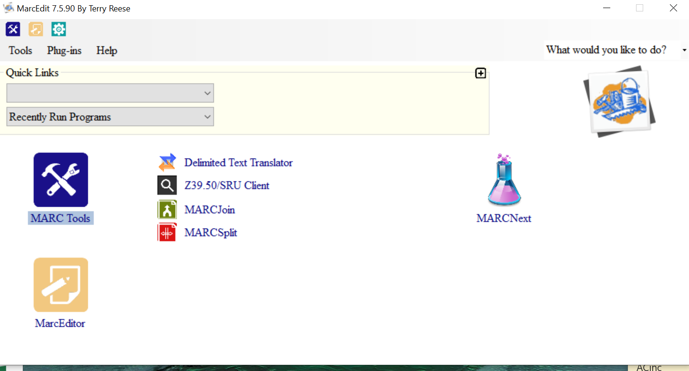
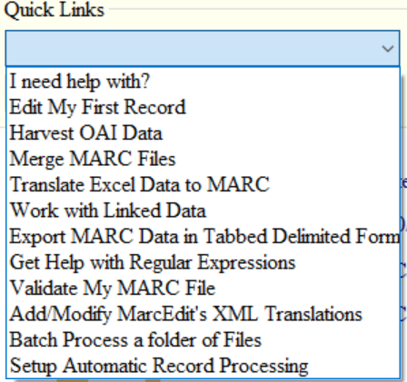
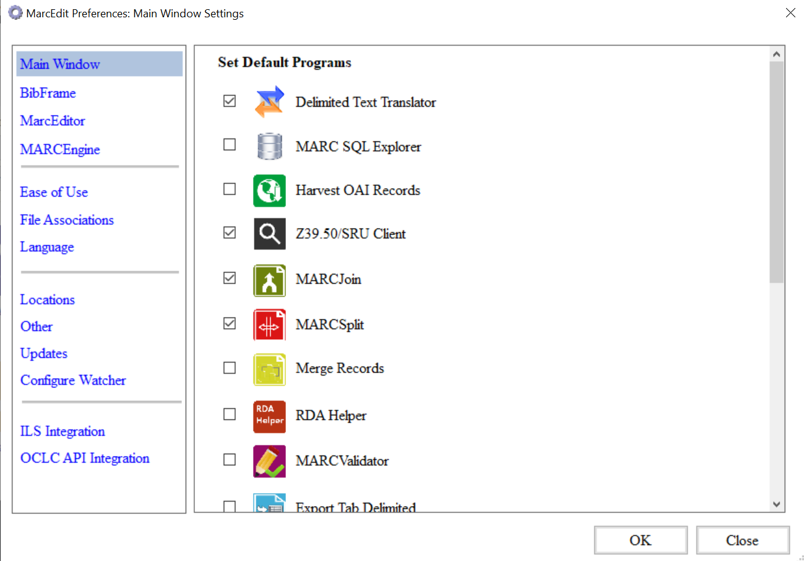
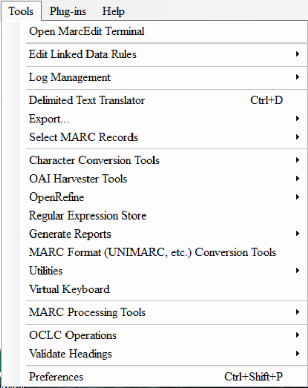

# Top Level Menu Features

## Where are the top level menu features?
When you first open MarcEdit, the main menu or the main window opens. From here, you can access the many features and tools. One thing you'll notice is that there are both shortcuts, linked icons, and menu options that lead to the same features. For example, to join records in one MARC file with another one, you can click on your MARCJoin shortcut if you have added that to your shortcuts, or you can go to Tools --> MARC Processing tools -->  MARCJoin.

It is from the main window where you can access the primary MarcEdit features or the MarcTools, Preferences, Plug-ins, and Help.
 

### MarcEdit Main Menu: Preferences
MarcEdit remembers what you did last in the Quick Links section. For those features you access frequently, Quick Links will get you there.

To personalize your MarcEdit further, preferences allows you to change or reset settings for MarcEdit. Preferences include the font and font size used in the MarcEditor, the default character encoding for records opened in the MarcEditor (such as MARC8 or UTF-8), the tools that appear in the MarcEdit Main Menu Window, or languages for instance. Sometimes it is necessary to close and reopen MarcEdit once you have changed your preferences.

#### MarcEdit Tools: Features
When you click on MARCEdit Tools Icon from the Main Menu, the available features are:
* MarcBreaker: This "breaks" the MARC binary file into a readable format that can be edited in the MarcEditor.
* MarcMaker: This takes the readable format MARC data file and creates the MARC binary file.
* MARC21 to MARC21XML: This converts a MARC21 file to MARC21XML.
* MARC21XML to MARC21: This converts a MARC21XML file to a MARC21 binary file.
* MARC to JSON: This converts a MARC21 file to a JSON file.
* JSON to MARC: This converts a JSON file to a MARC21 file.
* JSON to XML: This converts a JSON file to XML.
* XML to JSON: This converts an XML file to JSON.

Options include changing the default character encoding only for the tool that you select, translating the MARC data to MARC-8 or UTF8. To change the default character encoding, you will need to go to Settings.

The conversions from one encoding standard to another, as in MARC21 to MARC21XML, rely on eXtensible stylesheets. MarcEdit comes with several default stylesheets which come from those maintained by the Library of Congress. If you are familiar with stylesheets, you can also create your own.

There are more features available with the top level menu option called Tools. There are so many options here. Some will be covered in Integrations in Lesson 8. Let's highlight some:
* Preferences: This will take you to Settings. Often in MarcEdit, there is more than one place to get to a feature or setting. Here you can click on the gear icon to set your preferences or to Tools and then Preferences.  
* Delimited Text Translator: If you have a spreadsheet of data, this tool will take that data and create MARC data.
* Export: You can export a MARC record. More importantly, you can export a Tab Delimited file from MARC data. This tool will take a MARC binary file and create a spreadsheet (either tab or comma separated based on your selection) of all the MARC data.
* MARC Processing Tools: Features include MARCSplit, MARCJoin, Merge, MARCCompare, MARCValidator, or finding duplicate records.

You can set up to four MARC Processing Tools in Preferences that can be added to the Main Menu Window as shortcuts. For example, if you use MARCJOIN frequently, then you can add this to the Main Menu Window.

>## How do you update the default character encoding setting for MarcEdit?
>
>1. Change or verify the default character encoding setting to UTF8
>
> > ## Solution
> > 1. Click on the gear icon in the Main Menu window or go to Tools and then Preferences
> > 2. Click on MarcEditor
> > 3. In the Default Encoding down down menu, select UTF8
> > 4. Click OK
> {: .solution}
{: .challenge}

>## Can you change the font used in the MarcEditor to Arial and size 14?
>
> > ## Solution
> > 1. Click on the gear icon in the Main Menu window or go to Tools and then Preferences
> > 2. Click on MarcEditor
> > 3. In the Set MarcEditor Font Properties window, click on Set Font
> > 4. Scroll down to Arial and select font size 14
> > 5. Click OK
> {: .solution}
{: .challenge}

> ## Can you reset your Preferences back to the defaults?
>
> If you don't like the font and size, you can go back to the defaults.
> Go back to Settings by clicking on the gear icon or Tools and Preferences
> Go to MarcEditor
> In the Set MarcEditor Font Properties, click on Set Defaults.
>
{: .callout}

>## Can you add any MARC Processing Tool to the Main Menu Window as a shortcut?
>
> > ## Solution
> > 1. Click on the gear icon in the Main Menu window or go to Tools and then Preferences
> > 2. The top option Main Window should already be highlighted. If not, click on Main Window
> > 3. Check off MARCJoin
> > 5. Click OK
> {: .solution}
{: .challenge}

> ## MarcEdit Plugins
>
> There are a number of useful plugins that can be added to MarcEdit to extend its functionality. Examples include: MARC to KBART converter or cuttering tool.
> You can find more information on plugins on the [MarcEdit Plugin page](https://marcedit.reeset.net/managing-plugins-in-marcedit)
{: .callout}
