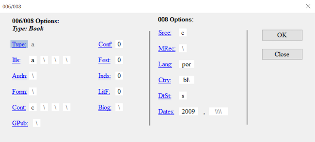

::::::::::::::::::::::::::::::::::::::: objectives

- Explain how to find, find all, and replace
- Explain how to add, update, and remove fields, subfields, indicators, and fixed fields
- Explain the difference between save and compile
- Successfully manipulate MARC data
- Successfully save your MARC data
- Successfully compile your MARC data

::::::::::::::::::::::::::::::::::::::::::::::::::

:::::::::::::::::::::::::::::::::::::::: questions

- How can MARC data be manipulated?
- How can fields, subfields, and/or indicators be added, changed, or removed?
- How can fixed fields be manipulated?
- What is the difference between save and compile?

::::::::::::::::::::::::::::::::::::::::::::::::::

## Manipulating MARC data

We've seen how we can manually and individually edit records in the MarcEditor, however, MarcEdit provides a number of more powerful ways to manipulate our MARC data. Fields, subfields, indicators can be added, removed, or changed. Fixed fields can be corrected. Fields and subfields specific to RDA can be added while AACR2 conventions are removed. It is possible to work with a subset of MARC data and then incorporate those changes into the original whole MARC data set. The variations sometime seem endless and give more weight to the nickname of MarcEdit, the swiss army knife of MARC data.

### Find, Find All, and Replace

Like many other applications, the MarcEditor offers the ability to Find, Find All, and Replace. 

Find: Find will search as a keyword what you enter into the Find window search box. This option will only search the current page in the MarcEdit. Remember that the default settings splits the MARC records into 100 for each page. Find will only search those records on the page you are currently on. 

Find All: Find all will search for your search terms entered in the Find window search box over all the pages, or all your MARC records.

Replace: Replace works alongside Find or Find all. You have the option to Replace just those on the page or Replace all where the replace occurs on all pages in all records.

If you want to Find or Find all a MARC field, you will need to include the equals sign before the MARC field. For example, if you type in the search box 856, Find or Find All will search for 856 as a keyword anywhere. If there is a title such as "The Jourey of the 856 people", this will then show up in your search results. If you search for =856, it will find anything with that string. If for example there is a title with "... =856 ..." then this will also appear in the search results. Typically the equals before the MARC tage will bring up that MARC tag. 

:::::::::::::::::::::::::::::::::::::::::  checklist

## Find, Find All, and Replace using the MARC field 856

1.  Go to Edit->Find (or CTRL+F)
2.  In the search box in the new window, type in 856
3.  Click Find
4.  What results to you see?
5.  Close that window
6.  Go to Edit->Find (or CTRL+F)
7.  In the search box in the new window, type in =856
8.  Click Find All
9.  What results to you see

::::::::::::::::::::::::::::::::::::::::::::::::::

:::::::::::::::::::::::::::::::::::::::  challenge

## Add a proxy to the MARC field 856

1. Find those MARC fields 856 where there is a subfield 3 for Full text follow by a subfield u
2. Add this proxy https://proxy.edu?url=

:::::::::::::::  solution

## Solution

1. Click Edit->Replace
2. In the search box for Find, type in =856  40\$3Full text:\$u
3. In the search box for Replace, type in =856  40\$3Full text:\$uhttps://proxy.edu?url=
4. Undo those changes.

:::::::::::::::::::::::::

::::::::::::::::::::::::::::::::::::::::::::::::::

:::::::::::::::::::::::::::::::::::::::::  callout

## Find and Replace

Remember to always verify that the search results of the Find or Find All. Find or Find all will search that exact phrase or string that you put into the search box either on that page (Find) or in every record (Find all). 

::::::::::::::::::::::::::::::::::::::::::::::::::

### Add/Delete a MARC field

To add or delete a MARC field, go to Tools in the upper menu in the MarcEditor and select Add/Delete Field. This will open a new Batch Editing Tools window. The Add/Delete Field functions are on the same menu level and you will need to select the action of either add or delete using the buttons on the right hand side.

In the top middle section of the window, there are two data entry fields: Field and Field Data. Enter the MARC field number you want to add or delete in the Field dialogue box. Then enter the indicators, subfields, and data in Field Data dialogue box. Remember to include the dollar sign to indicate a subfield.

{alt='MarcEdit empty Add/Delete Field dialog'}
{alt='MarcEdit completed Add/Delete Field dialog'}

To add the field, click the Add Field button and to delete any matching fields, click the Delete Field button.

For both the Add Field and Delete Field functions there are a number of different options that can be applied to control the updates.

The options to Add a Field include, if the field you are adding already exists, it can be inserted first in the list of those MARC fields or last. MARC fields can be added only if that MARC field is not already present in that record or based on the presence of other criteria found in other MARC fields. For example, a MARC field `655  \4$aElectronic books` can be added to only those records that are eBooks based on the data in the LDR or 008.

The options to Delete a Field include removing duplicates, removing MARC fields based on field position, removing MARC fields that do not match what is entered in the Field Data, or removing invalid UTF-8 MARC fields. For example, to ensure that only the field `655  \4$aElectronic books`. is present in the MARC data, the option Remove if field data does not match can be selected.

:::::::::::::::::::::::::::::::::::::::  challenge

## Add and then delete a MARC field

1. Add a 655 for electronic books with first indicators blank and second indicator 4 to the MARC data.
2. Delete that 655 that you just added.

:::::::::::::::  solution

## Solution

1. Go to Tools in the upper menu in the MarcEditor
2. Select Add/Delete Field (F7)
3. In the Field box enter 655, in the Field Data box enter `\4$aElectronic books`.
4. Click Add Field. You can also preview this change by clicking on the arrow on the right of Add Field and selecting Preview in the 7.5 version of MarcEdit
5. Check your MARC data. Was this MARC field added?
6. To delete this field, go back to Tools and select Add/Delete Field (F7)
7. In the Field box enter 655
8. In the Field Data box enter `\4$aElectronic books`.
9. Click on the Delete Field button. You can also preview this change by clicking on the arrow on the right side and selecting Preview in the 7.5 version of MarcEdit

:::::::::::::::::::::::::

::::::::::::::::::::::::::::::::::::::::::::::::::

:::::::::::::::::::::::::::::::::::::::::  callout

## Metacharacter syntax in the MarcEditor

Within the batch editing tools, MarcEdit uses the X metacharacter to represent a numeric range for selecting and editing fields. For example, if you enter 24X, that edit will act on fields 240-249; if you enter 5XX, that edit will act on fields 500-599.

::::::::::::::::::::::::::::::::::::::::::::::::::

:::::::::::::::::::::::::::::::::::::::  challenge

## Delete a range of MARC fields that begin with a number

1. Verify your data contains multiple 9XX fields.
2. Delete all 9XX fields.

:::::::::::::::  solution

## Solution

1. Verify your file has multiple 9XX fields by using the Field Count report (Reports → Field Count), or by using Find (Edit → Find  "=9" → Find All)
2. Go to Tools in the upper menu in the MarcEditor
3. Select Add/Delete Field (F7)
4. In the Field box add 9XX
5. Click on the Delete Field button. You can also preview this change by clicking on the arrow on the right side and selecting Preview in the 7.5 version of MarcEdit
  
  

:::::::::::::::::::::::::

::::::::::::::::::::::::::::::::::::::::::::::::::

### Add, Delete, or Change information for a subfield in a MARC field

To edit subfield data within a given field, go to Tools and select Edit Subfield Data. A new Batch Editing Tools window will open (notice that this is the same window that opened for Add/Delete a field, you can also navigate between the MarcEdit Batch Editing Tools using the labels on the left hand side of the window). From here you can add a new subfield, delete a subfield, or replace text in a subfield. Set your desired subfield edit conditions by selecting the appropriate option(s) from the Search Options list.

To add a subfield, enter the MARC field and then the subfield. The text you would like to add in that subfield is entered in Replace With box. Select New subfield only from the Search Options below and then click Replace Text. Even though you are adding a subfield, you still click Replace Text. For adding a subfield, the information that goes in that field doesn't go in the box called Field Data, see the example below.

To delete a subfield, enter the MARC field and then the subfield. Select Delete Subfield from the Search Options and then click Remove Text.

To replace text in a subfield, enter the MARC field, the subfield, the text (or information) that needs to be changed in the Field Data box. Enter your updated text in the Replace with box. Click on Replace Text.

{alt='MarcEdit empty edit subfield dialog'}
{alt='MarcEdit completed edit subfield dialog'}

:::::::::::::::::::::::::::::::::::::::::  callout

## Ability to Preview and Special Undo

As of version 7.5, you can preview all of these changes before making them.
If you complete a batch edit that produces unexpected or undesirable results, you can perform a Special Undo by selecting Edit → Special Undo.
This will only on your most recent batch edit. If you perform an action after your batch edit, Special Undo will not undo your batch change but the action you just performed.

::::::::::::::::::::::::::::::::::::::::::::::::::

:::::::::::::::::::::::::::::::::::::::  challenge

## Add and then Delete a MARC subfield

1. Change the `$5` for the MARC field 500 from FU to your own Library of Congress Organization Code. If you are unsure of your Library of Congress Organization Code, update the code to XYZ.
2. Delete that `$5` that you just changed.

:::::::::::::::  solution

## Solution

1. Go to Tools in the upper menu in the MarcEditor
2. Select Edit Subfield Data (F9)
3. Add 500 in the Field box, 5 in the Subfield box, FU in the Field Data box, and your LC Organization Code in the Replace With box
4. Click on the Replace Text button.
5. Check your MARC data. Was FU changed to your LC Organization Code?
6. To delete this subfield, go back to Tools and select Edit Subfield Data (F9)
7. Enter 500 in the Field box, 5 in the Subfield box
8. Click on the Remove Text button.
  
  

:::::::::::::::::::::::::

::::::::::::::::::::::::::::::::::::::::::::::::::

::::::::::::::::::::::::::::::::::::::::::::::::::

### Change one or both indicators in a MARC field

Sometimes it is necessary to change one or both indicators of a MARC field. To edit field indicators, go to Tools and select Edit Indicators. This will open a new Batch Editing Tools window. Enter the MARC field and the indicators that you would like to change. Enter the new indicators you want in the Replace With Indicators box. Here you will want to be careful of the combinations of indicators. If you leave the Indicators box blank and add indicators in the Replace With Indicators box, all the indicators for that MARC field will be changed to the indicators entered in the Replace With Indicators box.

{alt='MarcEdit empty edit indicators dialog'}
{alt='MarcEdit completed edit indicators dialog'}

:::::::::::::::::::::::::::::::::::::::  challenge

## Change an indicator for a MARC field in your MARC data

1. Change the first indicator of the MARC field 050 to 1 for those MARC fields 050 that have a first indicator blank and a second indicator 4.

:::::::::::::::  solution

## Solution

1. Go to Tools in the upper menu in the MarcEditor
2. Select Edit Indicators (F8)
3. Add `050` in the Field box, `\4` in the Indicators box, and `14` in the Replace With Indicators box. Leave the Field data box blank
4. Click on the Replace button.
5. Check your MARC data. Were the `050 \4` updated to be `050  14`?
  
  

:::::::::::::::::::::::::

::::::::::::::::::::::::::::::::::::::::::::::::::

## Working with MARC fixed fields

Working with fixed fields can be difficult. In the MarcEditor, you can edit one fixed field using the easy editing window. If you put your cursor on that fixed field, such as an 008 or 006, then go to Edit and select Field 006 or Field 008. This will open up a window where you can edit the fixed field for that specific MARC record.

You can also batch insert an 006 or 008 into your records. To insert a fixed field go to Edit and select the appropriate Insert/Edit.

{alt='MarcEdit fixed fields editor'}

:::::::::::::::::::::::::::::::::::::::::  callout

## Batch Editing Fixed Fields in Multiple MARC Records

Sometimes it is necessary to change a fixed field for all records in your MARC data. You can use the Edit Field function. For this, you will need to know the position of the fixed field. For this, you can consult the [OCLC Bibliographic Standards and Formats](https://www.oclc.org/bibformats/en.html) or [the Library of Congress Bibliographic Marc Standard](https://www.loc.gov/marc/bibliographic/). This is also possible using the Replace function and regular expressions which will be covered in Lesson 09.

::::::::::::::::::::::::::::::::::::::::::::::::::

## Saving, Compiling and Version Control

The MARC data that you manipulate in the MarcEditor is in a human and computer readable mnemonic `.mrk` file format that was broken from the original binary `.mrc` file. You will notice that the file name of the file you're working on, displayed at top of the MarcEditor, has the file extension `.mrk`. If you look at the file in your file directory, the file icon color is blue whereas the binary `.mrc` MARC file icon is purple. 

### Saving
When you save in the MarcEditor, you are saving your latest changes as a `.mrk` file. Using File → Save will save edits into your current `.mrk` file, overwriting the original. To keep a copy of your original `.mrk` data, select File → Save As and choose a new file name for your edited records. 

### Compiling
To save your edited records back into a MARC binary `.mrc` file (the file format typically required to load MARC records in external systems such as your ILS or LSP) use the compile feature. Select File → Compile File into MARC. Choose a new file name for your edited `.mrc` file. Using the same file name as your original `.mrc` file will overwrite the unedited file. 

Records can also be compiled outside of the MarcEditor using the MarcMaker tool. To use the MarcMaker, from the Main Menu select MARC Tools. In the MARC Tools window, under Select Operation choose MarcMaker. Under Select Data to Process, in the Open box, select the `.mrk` file you'd like to compile. In the Save As box, specify the location and file name for your new `.mrc` file. Set the character encoding options as required, and then click Execute. Once compiled, you will see a message under Results specifying the number of records in the new  `.mrc` file.

:::::::::::::::::::::::::::::::::::::::: keypoints

- MarcEdit can be used to edit any part of the MARC data including the Leader, fixed fields, fields, indicators, subfields and the content in those fields.
- MarcEdit comes with an array of tools to manipulate data and validate MARC.

::::::::::::::::::::::::::::::::::::::::::::::::::

