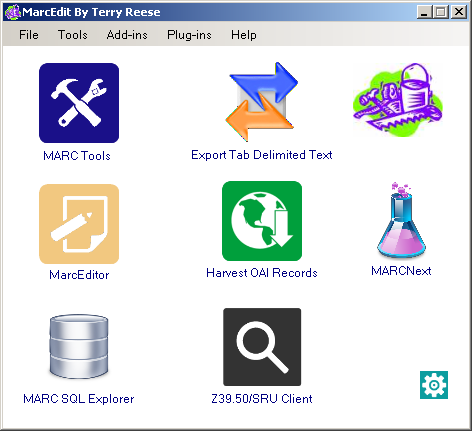
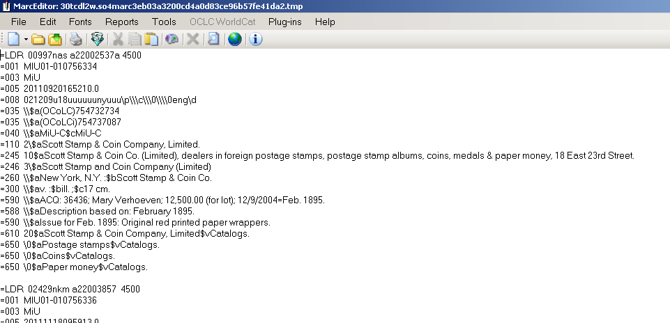
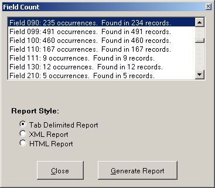
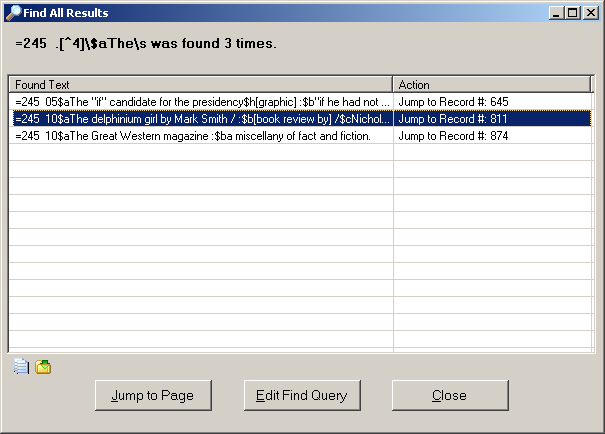




# Introduction to MarcEdit

This Introduction to MarcEdit is based on materials developed by Owen Stephens ([owen@ostephens.com](mailto:owen@ostephens.com)) in November 2015.

This work is licensed under a Creative Commons Attribution 4.0 International License

[http://creativecommons.org/licenses/by/4.0/](http://creativecommons.org/licenses/by/4.0/).

It is suggested when crediting this work, you include the phrase “Developed by Owen Stephens”

The exercises in this document were designed for and have been tested with MarcEdit 6.2 on Windows. Most of the exercises will also work on other versions and platforms, but they have not been tested.

**1. Getting Started**

## What is MarcEdit

MarcEdit is a piece of software for editing MARC records developed by Terry Reese (now at Ohio State University, although the original development was done during a project at Oregon State University). MarcEdit can be used to make small, single, edits to individual MARC records, but is particularly aimed at making edits across many MARC records at a single time.


## Downloading MarcEdit

MarcEdit can be downloaded from [http://marcedit.reeset.net/downloads](http://marcedit.reeset.net/downloads)

MarcEdit was originally written for Windows but there are now versions available for Windows, Mac and Linux.

All screenshots in this document are taken from the Windows version and may be a little different from the Linux or Mac versions, although it should be possible to complete all the exercises in this document no matter which version you are using.

**Going Further**

Use the settings (cog) icon on the opening screen to modify the shortcuts that appear on the screen, so the functions you use most often are the ones that are displayed when you open MarcEdit each time.


## The MarcEdit interface


The MarcEdit interface is a little different to standard Windows or Mac software. On starting the software, the first screen shows a set of icons for different tools within MarcEdit. This screen can be customised so that you can access the tools you use most from this starting screen.

Most tools within MarcEdit can be accessed from more than one place within the MarcEdit interface. For example from this starting screen  the 'MARCValidator' function can be accessed:

*   via the 'Add-ins' menu in the opening screen
*   via the 'Reports' menu in the MarcEditor (see Exercise 1 below)
*   via the 'Tools' menu in the MarcEditor 
*   using Ctrl+M in the MarcEditor

This can make the interface a little confusing when you first start using MarcEdit!

## Getting Help

The MarcEdit application contains extensive help information within the application, as well as providing links to online resources. In addition the Help page at [http://marcedit.reeset.net/help](http://marcedit.reeset.net/help) provides links to the MarcEdit email list and further online support materials including a set of video tutorials by Terry Reese.

Terry Reese is incredibly helpful and is on Twitter (@reese_terry) and provides his email address for questions from [http://marcedit.reeset.net/help](http://marcedit.reeset.net/help)

**2. MarcEdit basics**

All exercises in this document use a file of MARC records called 'me-eg-records.mrc' which can be downloaded from:

[http://bit.ly/training-data](http://bit.ly/training-data) 

These records are derived from [a set of MARC records made available by the University of Michigan Library under a CC0 licence](http://www.lib.umich.edu/open-access-bibliographic-records).


## Exercise 1: Opening MARC records in the MarcEditor

If you want to view and/or directly edit MARC records in MarcEdit, you do this using the MarcEditor. This can be accessed directly from the (default) start screen, or from the File menu.


Click the MarcEditor option, and the MarcEditor will open with an empty screen:

To edit a record, you need to open a file which contains one or more MARC records. This can be done (as you might expect) using the usual File menu, Open option, or by clicking the appropriate icon in the MarcEditor toolbar (second from the left).

The MarcEditor recognises files of the following types:


<table>
  <tr>
   <td><strong>File type</strong>
   </td>
   <td><strong>File extension</strong>
   </td>
  </tr>
  <tr>
   <td>MARC file
   </td>
   <td>mrc
   </td>
  </tr>
  <tr>
   <td>MARC Text File
   </td>
   <td>mrk
   </td>
  </tr>
  <tr>
   <td>MARC UTF-8 Text File
   </td>
   <td>mrk8
   </td>
  </tr>
  <tr>
   <td>MARCXML file
   </td>
   <td>xml
   </td>
  </tr>
  <tr>
   <td>MODS file
   </td>
   <td>xml
   </td>
  </tr>
  <tr>
   <td>Text files
   </td>
   <td>txt
   </td>
  </tr>
</table>


In order to work with these different file types correctly MarcEdit expects them to use the file extension as specified in this table. You may sometimes find that you need to rename files to use the correct extension before they will work as expected in MarcEdit. For example, when you download MARC records from a library catalogue or OCLC, you may find they use a different file extension (e.g. txt, dat) rather than 'mrc' even though they are MARC files. In these cases you will need to rename the file to use the 'mrc' file extension so that MarcEdit recognises them correctly.

To open a file of MARC records in the MarcEditor:


*   Download the file called 'me-eg-records.mrc; from [http://bit.ly/training-data](http://bit.ly/training-data) 
*   Open the MarcEditor
*   Click File->Open in the MarcEditor
*   Change the File Type to "MARC Files (*.mrc)"
*   Choose the file you have downloaded
*   Click 'Open'

You should now see the MARC records from the file displaying in the MarcEditor



The MarcEditor displays the records in what is called the 'MARC Text File' format (file extension *.mrk). Each line in the file represents a field in a MARC record:


```
=245  14$aThe Lord of the Rings /$c J.R.R. Tolkien.
```


This breaks down as follows:


<table>
  <tr>
   <td><code>=</code>
   </td>
   <td>Each line/field starts with the '=' sign
   </td>
  </tr>
  <tr>
   <td><code>245</code>
   </td>
   <td>The '=' is followed immediately by the three character MARC field code
   </td>
  </tr>
  <tr>
   <td><code>[two spaces]</code>
   </td>
   <td>The MARC field is always followed by two spaces
   </td>
  </tr>
  <tr>
   <td><code>14</code>
   </td>
   <td>The field indicators follow the spaces - if the field has indicators. For the control or fixed fields, the field content starts directly after the spaces
   </td>
  </tr>
  <tr>
   <td><code>$aThe Lord of the Rings /$c J.R.R. Tolkien.</code>
   </td>
   <td>The field content contains the subfields (indicated using the '$' symbol) and the text. Because the subfields use the '$' symbol, any real occurrences of the dollar symbol (e.g. for currency) is shown as "[dollar]" instead.
   </td>
  </tr>
</table>


Records in the MarcEditor display are separated by a blank line.

The MarcEditor divides a file of MARC records into 'pages' of 100 records. You can scroll up and down the page of MARC records using the scroll bar as usual, but to see the next 100 records you need to use the Next/Previous page controls which are at the bottom left of the screen. The MarcEditor can cope with very large files of MARC records, because it never tries to load all the records at the same time.

You can adjust the number of records displayed per 'page' through the MarcEditor preferences which can be accessed through the Tools->Preferences menu option from the MarcEditor, or through the 'Settings' icon on the opening screen of MarcEdit.


## Exercise 2: Editing and saving MARC records in the MarcEditor

To make a simple edit to a MARC record you can simply click into the MarcEditor at the point where you want to edit and start typing.

If you've completed Exercise 1, you should have the MarcEditor open, with a file of MARC records. 


*   Look at the first record ("Scott Stamp & Coin Co. (Limited), dealers in foreign postage stamps ...") Find the the $v subfield in the '610' field and note the incorrect spelling of "Catalogues" (it should be 'Catalogs')
*   Click on the word "Catalogues" just after the 'e'
*   Hit the delete button to remove the 'e' and the 'u'

You can now save the file by:


*   Click File->Save in the MarcEditor
*   Note that the default is to save as file type "MARC Text File (*.mrk)" - leave this as the option
*   Add a file name and choose an appropriate location
*   Click "Save"

You have now saved the edited file as a MARC Text file. You can work on this file further in the MarcEdit, but usually to be able to use with other software (e.g. loading the records into your library management system or equivalent) you will need to create a MARC file (*.mrc). See Exercise 8 for more information on doing this.

You can carry out more extensive editing using this approach - adding or deleting text, subfields, whole fields or even complete records. However, when you have changes to make to many records, there are more effective approaches that can be used.


## Exercise 3: Using Find and Replace to edit multiple records

When there is an issue that is repeated over many issues or fields, you can use the Find/Replace function to make a similar change across many lines in the MarcEditor. When used in the simplest way, this works very much like find/replace in software such as Microsoft Word.

You may have noted in Exercise 2 that the issue with using the wrong spelling of 'Catalogues' in the $v (form subdivision) is repeated across several fields in the first record. Using Find and Replace we can find out how many records are affected and correct them all at once.

To simply find all the similar issues in the file:


*   Click Edit->Find 
*   In the box labelled 'Find What' type "$vCatalogues"
*   Click 'Find All'
*   This will find all occurrences of the error in the file as a list of fields (lines) in the MarcEditor file. You can then jump to any specific occurrence in the file by clicking on the line

This might help if you only had a few issues to correct, but in this case there are more than we want to correct one-by-one. In this case the 'Replace' option can be used:


*   Click Edit->Replace
*   In the box labelled 'Find What' type "$vCatalogues"
*   In the box labelled 'Replace with' type "$vCatalogs"
*   Click Replace All
*   The MarcEditor should tell you that 20 modifications have been made

If you now repeat the 'Find' option as above, you should see that there are no occurrences of '$vCatalogues' in the file.


## Exercise 4: Remove unwanted local fields

When you obtain records from an external source, you may wish to remove any local fields from the records.

**Use the Field Count report to find what fields are present in the records**

To find what fields are present (and how many times they appear) in the file you can use the Field Count report.

*   From the Reports menu choose the Field Count option
*   The Field Count report will display, including options to export the results in a number of formats

Scrolling down the report you can see (for example) that the 090 field (local call number) appears 235 times (in 234 records):



**Remove the 090 using Add/Delete Field**

To remove the 090 fields from all records, use the Add/Delete Field function:


*   Choose the Tools->Add/Delete Field menu option (you can also access this using the F7 key)
*   In the 'Field' box type '090'
*   Click 'Delete Field'
*   You should get a notification that 235 field were deleted


## 


## Exercise 5: Create a MARC file

When you have completed your edits to a file of MARC records, you will usually want to convert it back into a MARC File. There are at least three ways of doing this in MarcEdit:


1. In the MarcEditor, with the file open, choose File->Save As, and choose 'MARC Files (*.mrc) in the 'Save as type' prompt in the save file dialogue
2. In the MarcEditor, with the file open, choose File->Compile File into MARC. You will be prompted for a file name and location
3. Save the file in the MarcEditor as a "MARC Text File (*.mrk)" and then close the editor. In the MarcEdit windows, choose 'MARC Tools' and use the 'MarcMaker' function to convert the 'mrk' file to an 'mrc' file

**Going Further**

**Using MARC Tools in MarcEdit**

The MARC Tools support converting one metadata format into another. Most of the options are based around some version of MARC, but there are also options for Dublin Core, MODS and EAD.

To use the tool you specify in Input File (which contains the data in the starting format) and an Outputfile (which will be created when you run the tool). You then choose the 'Function' from the list provided. For example MARC21 => MARC21XML to convert MARC records into MARCXML records.

Most of the options are named in a straightforward way indicating the source and destination formats. However, there are two more obscure functions:

MarcBreaker - converts a MARC file (*.mrc) into MarcEdit's MARC Text File (*.mrk) format

MarcMaker - converts a MarcEdit MARC Text File (*.mrk) into MARC file (*.mrc) format

A common workflow described in MarcEdit tutorials is to get a MARC file from a source (e.g. a library management systems), use MarcBreaker at the start of the editing process to create a MARC Text File, edit the file using the MarcEditor, saving as you go along, and then at the end of the process convert the file back to MARC format using the MarcMaker.

## Exercise 6: Find and correct records with incorrect non-filing indicators

You can use the Find options in the MarcEditor to identify problems with MARC records. In this exercise you will use the Find option to find records which may have an incorrect non-filing indicator in the 245 field.

*   Choose the Edit->Find menu option (you can also access this using Ctrl+F)
*   In the Find box type a regular expression to find the pattern you want. In this case "=245  .[^4]\$aThe " (N.B. there are two spaces between the '5' and the '.', and a single space following the word "The")
*   Check the 'Use regular expressions' box
*   Click 'Find All'



*   You should be shown a list of all matching lines from the file:
*   To correct individual records you can click the line you want to edit then click 'Jump to Page'.
*   To correct all records you can click 'Edit Find Query' and use a 'Replace' query rather than a Find query to not only identify all incorrect records, but to replace the second indicator with a '4' using a regular expression with capture groups (as in Exercise 3 above)


## Exercise 7: Find and correct records which have a 245 that doesn't finish with a full stop

In this exercise you will use the Replace option to insert a full-stop at the end of any 245 fields that are missing that punctuation. This demonstrates the use of a regular expression 'capture group' in a MarcEdit Find/Replace operation


*   Choose the Edit->Replace menu option (you can also access this using Ctrl+R)
*   Check the 'Use regular expressions' box
*   In the 'Find what' box type a regular expression to find the pattern you want. In this case "`(=245.*[^.!?])$`"
    *   This finds any fields starting '=245' and finishing with a character other than a full-stop, question mark or exclamation mark
    *   The use of the brackets () in the regular expression 'capture' the matched text so we can use it in the replace expression
    *   A single Find expression can contain multiple capture groups, but in this case you are just using a single capture to get the whole of the 245 field (in cases where it doesn't finish with appropriate punctuation)
*   The content of each 'capture' in the Find regular expression can be used in the 'Replace with' box, using the dollar symbol plus the number of the capture group. For example '`$1`' in the Replace box will use the content of the first capture group from your Find expression.
*   In this case there is one and only one capture group in the Find expression, so in the 'Replace with' box type "`$1.`"
    *   This uses the text from the first (and in this case, only) capture group in the Find expression, and then adds a full-stop on the end
*   Click 'Replace All'

You should be told that 11 modifications have been made.


## Exercise 8: Create MARC records from an Excel Spreadsheet

MarcEdit can create MARC records from a file of tabular data - such as a CSV, TSV (comma/tab separated values) file or an Excel spreadsheet. In this exercise you will create a simple set of MARC records from an Excel spreadsheet which lists the items in an ebook package.


*   Download simple-bib-records.tsv.txt from [http://bit.ly/training-data](http://bit.ly/training-data) 
*   If you open the file (either in a text editor or in Excel) you can see that it contains three columns of information - the first column contains the title, the second column the ISBN and the third column a URL for the ebook
*   Close the file before you try to run the rest of the process described here, as you will find that having the file open in Excel while trying to get MarcEdit to read the file will prevent the process working correctly
*   The function used to create MARC records from tabular data is the 'Delimited Text Translator' (despite its name, this will also understand Excel spreadsheets). This can be accessed from the MarcEdit 'Add-ins' menu

The first part of the process is to specify what file you want to use as the starting point for your MARC records, and to set some basic options for the import:


*   Set the Source File to find the simple-bib-records.xls file you've just downloaded
*   Set the Output File (this will be a new file of MARC records that you are about to create from the spreadsheet)
*   Select 'Tab' as the Delimiter
*   Click 'Edit LDR/008' - this allows you to set a material type in order for a basic LDR and 008 to be generated for each record. Click the dropdown menu in the pop-up screen and choose 'Electronic Resource' then click 'OK'
*   You've now set all the required options on this screen and can click the Next button to proceed to the next step of transforming the spreadsheet to MARC

At this point MarcEdit should be able to find the data you want to use to create the MARC records. The next step in the process is to specify how data in the original file should be mapped to MARC fields. This is done by adding 'Arguments' - one for each field mapping.

On the screen you should see a summary (the 'Data Snapshot') of the file you are importing with each column labelled 'Field 0', 'Field 1', 'Field 2' etc. Underneath this summary is a 'Settings' section. This is where you instruct MarcEdit which MARC fields to use for each piece of information in the spreadsheet. This is done on a column-by-column basis, so you'll need to choose a single mapping for each column. Where a single column contains information which needs mapping to different MARC fields, this can be resolved in the MarcEditor later - for now just pick the best mapping you can do.

To do a mapping:


*   Click the 'Select' drop down and choose the column you want to map (Field 0 = the first column, Field 1 = the second column etc. - as shown in the 'Data Snapshot' part of the screen)
*   Enter the MARC field and subfield in the 'Map To' box. For example enter '245$a' to map a column to the 245 field, subfield a.
*   Set the indicators in the 'Indicators:' box if necessary. Again, you may not be able to set the correct indicators for all the lines in the spreadsheet (e.g. for non-filing characters), and you will probably need to use the MarcEditor to check and correct indicators for the created records.
*   If you wish to, you can set the 'Term. Punctuation' (Terminal Punctuation) as well - this is simply punctuation that will be added to the end of the field created in the MARC record
*   When you have filled out all the information click 'Add Argument' to add the mapping to the file processing - if you miss out this stage, the mapping will not be used!
*   Note that once you have created a mapping for a file, you can save this as a 'Template' which you can use again in the future - so if you have to transform data from the same spreadsheet/csv format on a regular basis, you don't have to do the mapping every time, you can simply re-load the template with the pre-existing mapping

Given the data in the file you will want to map the field as follows:


*   Field0 -> 245$a
*   Field1 -> 020$a
*   Field2 -> 856$u

Do not set any indicators (other than the default '\\' which is already filled in for you) and do not set any Terminal Punctuation.

To do this in the form you need to add the mappings one by one. First:


*   Select 'Field0' in the dropdown list
*   In the 'Map to' field type "245$a"
*   Click 'Add Argument' to save this mapping

Repeat this for Field1 (map to '020$a') and Field2 (map to '856$u')

Check the option to "Ignore Header Row" to make sure the first row in the file, which contains the column headers in our case, isn't used to create a MARC record.

Once you have done this, click the "Finish" button. This will create the file of MARC records (using the name/location specified in the 'Output File' option you set on the earlier screen).

Open the file in the MarcEditor. You should find you have a file of skeleton MARC records based on the information in the Excel spreadsheet. Because the first line of the Excel spreadsheet consisted of column headings, the first record will have been created using the column headings rather than real data. Simply delete the first record in the file to correct this issue.


## Exercise 9: Move ISSNs from 020 to 022

To do this exercise you first need to successfully complete Exercise 8 and open the the newly created file of basic MARC records.

While the majority of rows in the Excel spreadsheet used in Exercise 8 described books, with a ISBN in the second column, if you scroll down in the MarcEditor to the last records you can see that the last few records in the file are actually Serials/Journals rather than Books. This means that they have an ISSN instead of an ISBN, and the mapping has left this data in the wrong MARC field (020 instead of 022).

To correct this you can use the 'Copy Field' option that is in the MarcEditor Tools menu:


*   Open newly created file (from Exercise 8) in MarcEditor
*   Use the menus to choose Tools->Copy field
*   Tick the 'Use Regular Expressions' option
*   In the Source Field enter the value '020'
    *   (\d{4}-\d{3}[0-9xX])
*   In the Destination Field enter the value '022'
    *   022
    *   $1
*   Check 'Delete Source Field'

These settings tell the 'Copy Field' tool to find 020 fields containing 4 digits, followed by a hyphen, followed by 3 digits and then either an additional digit or an upper or lower case 'x' - this should match any valid ISSN. It also tells it to 'capture' the ISSN by using the ( ) brackets around the regular expression.

The Destination field setting of '$1' tells it to use the captured ISSN to populate the 022 field.

Finally using the 'Delete Source Field' option gets rid of the 020 field containing the ISSN (after successfully copying this the ISSN to a new 022 field in the record).

You should be told that 3 records have been affected.


## Exercise 10: Create Task List

A Task List allows you to run a set of repeated processes. In this case we can create a Task List that makes a number of changes to a basic set of MARC records created from a spreadsheet like this (e.g. if we get repeated sets of records in the same format)

Or we can create a Task List that contains just one or two things that we do regularly and don't want to have to retype each time. In this way a 'Task List' may only be a single operation (like the 'Copy Field' option in Exercise 9) where you need to do the same operation regularly, but you don't want to have to type in the settings and regular expression each time. By creating a Task List containing this single Task, you can just run the task without having to type in the detail each time.

Once a Task List has been created it can be used on any file you open in the MarcEditor. You can share Task Lists with others by using the 'Export Selected Task' and 'Import Task' options that are on the 'Manage Tasks' screen. Once you have exported a task you will have a file you can share with others (e.g. by email) which they can utilise by using the 'Import Task' option.

In this exercise you are going to create a simple task list which does two things:


1. Set correct indicators on an 856 field for a web resource accessed using http
2. Add a standard 'Link Text' to 856 fields by adding a $y subfield containing the link text to be used
*   Open the file you created in Exercise 8 in MarcEditor
*   Use the menus to choose Tools->Manage Tasks
*   Click the option to 'Create New Task List', and give the task list a name (e.g. 856 Corrections)
*   You will now be returned to the Manage Tasks options. In this screen select the newly created Task List from the Task Lists and click the 'Edit Selected Task List' option
*   This is where you can add specific operations (or tasks) to the task list. To do this...
*   Click 'Add New Task' icon (looks like  +). You will see a list of possible tasks you can choose from. The first task you are going to create is to set indicators on the 856 field so choose 'Add Edit Indicator Task'
*   You will now be shown a dialogue box almost identical to the options you would normally see if you choose the 'Tools->Edit Indicator Data' option from the MarcEdit menu. The only difference is that the background of the screen is slightly pink. This indicates you are in Task creation mode, and instead of running any command you add here, it will just be added to the task list
*   Fill out the form as follows:
    *   Field: 856
    *   Indicators: \\
    *   Field Data: LEAVE BLANK
    *   Replace with: 41
*   Once you have done this, Click "Replace". This will close the form and add the task to the task list. N.B. it is important to stress that the Edit Indicator operation hasn't been executed on your current Marc file - all that has happened is that the task has been added to the task list.

To add the second task - adding the $y subfield to the 856 - stay in the Edit Task List window and do the following:


*   Click 'Add New Task' icon
*   Choose 'Add Edit Subfield Task'
    *   Field: 856
    *   Subfield: $y
    *   Replace with: Access item online
    *   Check 'Add Subfield if not present'
    *   Click Replace Text

Now you've added these two operations to the task list you can save the list (Click Save) and then close the Task List Manager (Click Close).

You've now created a Task list, the remaining thing left to do is run the Task List to carry out the two operations:


*   Choose from the MarcEditor menu: Tools-->Current Available Tasks->[Name of Task]
*   This will run both operations, and you will get a summary of the changes that have been made

If you have tasks you run regularly it is also possible to assign a Task List to a keyboard combination (this is done in the 'Manage Task Lists' screen using the 'Key Assignment' option) to make it easy to run a set of tasks with a single keystroke (although this option is not available on a Mac).


## Exercise 11: Generate Call Numbers

In Exercise 8 you created some very basic MARC records. In Exercises 9 and 10 you made some corrections/enhancements to the records, but they are still very basic. In this exercise you will see how you can use the 'Generate Call Numbers' function to add call numbers and subject headings to these MARC records, hopefully making them much more useful when they are loaded into a library catalogue or library discovery tool (despite its name the Generate Call Numbers function does more than just add call numbers).

The Generate Call Numbers function looks up information provided by OCLC, and this process can take a little while. You could use the function on the whole file you created in Exercise 8, but this takes rather a long time, so for the purposes of this exercise it is recommended you copy three records from the file into a new file in the MarcEditor:


*   Highlight the first three records in the file you created in Exercise 8, and use Edit->Copy (or Ctrl+C) to copy them
*   To create a new, blank, file in the MarcEditor use the menu item: File->New->Open new window
*   Paste the records into this blank file

You are now ready to run the Generate Call Numbers tool. There are quite a few settings to choose with this tool, but they are mainly very straightforward options:


*   To run the tool choose the menu item: Tools->Generate Call Numbers
*   The first time you run this tool you will be asked to agree to some terms and conditions from OCLC, as the tool uses a OCLC service to find call numbers and subject headings
*   On the next screen click the option to 'Add To All Records', then click 'Choose Classification' link
*   You can choose between adding Dewey Decimal and Library of Congress classification - in this case choose 'Dewey Decimal'
*   Choose the option to 'Always Add Headings' (in the FAST Subject Headings section)
*   You are now ready to run the tool - you do this by clicking the 'Classify' button
*   The tool will now look up each record in your file against the OCLC service - it does the look up using one or more control numbers in your record - in this case the records only have ISBNs, so this is used, but the service would also use OCLC numbers if they were present
*   The process may take several minutes (even for just 3 records), but once it is complete you should see that subject headings and Dewey Decimal classifications have been added to your skeleton MARC records

