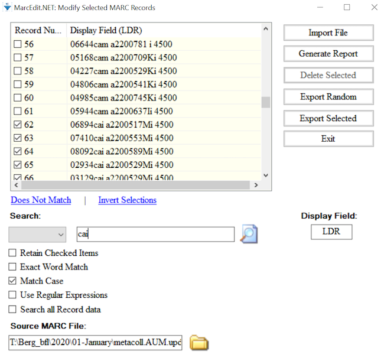

## Manipulating MARC data
We've seen how we can manually and individually edit records in the MarcEditor, however, MarcEdit provides a number of more powerful ways to manipulate our MARC data. Fields, subfields, indicators can be added, removed, or changed. Fixed fields can be corrected. Fields and subfields specific to RDA can be added while AACR2 conventions are removed. It is possible to work with a subset of MARC data and then incorporate those changes into the original whole MARC data set. The variations sometime seem endless and give more weight to the nickname of MarcEdit, the swiss army knife of MARC data.

### Add/Delete a MARC field
To add or delete a MARC field, go to Tools in the upper menu in the MarcEditor and select Add/Delete Field. This will open a new Batch Editing Tools window. The Add/Delete Field functions are on the same menu level and you will need to select the action of either add or delete using the buttons on the right hand side.

In the top middle section of the window, there are two data entry fields: Field and Field Data. Enter the MARC field number you want to add or delete in the Field dialogue box. Then enter the indicators, subfields, and data in Field Data dialogue box. Remember to include the dollar sign to indicate a subfield.
  
  

To add the field, click the Add Field button and to delete any matching fields, click the Delete Field button.

For both the Add Field and Delete Field functions there are a number of different options that can be applied to control the updates.

The options to Add a Field include, if the field you are adding already exists, it can be inserted first in the list of those MARC fields or last. MARC fields can be added only if that MARC field is not already present in that record or based on the presence of other criteria found in other MARC fields. For example, a MARC field 655  \4$aElectronic books can be added to only those records that are eBooks based on the data in the LDR or 008.

The options to Delete a Field include removing duplicates, removing MARC fields based on field position, removing MARC fields that do not match what is entered in the Field Data, or removing invalid UTF-8 MARC fields. For example, to ensure that only the field 655  \4$aElectronic books. is present in the MARC data, the option Remove if field data does not match can be selected.

>## Add and then delete a MARC field
>
>1. Add a 655 for electronic books with first indicators blank and second indicator 4 to the MARC data.
>2. Delete that 655 that you just added.
>
> > ## Solution
> > 1. Go to Tools in the upper menu in the MarcEditor
> > 2. Select Add/Delete Field (F7)
> > 3. In the Field box enter 655, in the Field Data box enter \4$aElectronic books.
> > 4. Click Add Field. You can also preview this change by clicking on the arrow on the right of Add Field and selecting Preview in the 7.5 version of MarcEdit
> > 5. Check your MARC data. Was this MARC field added?
> > 6. To delete this field, go back to Tools and select Add/Delete Field (F7)
> > 7. In the Field box enter 655
> > 8. In the Field Data box enter \4$aElectronic books.
> > 9. Click on the Delete Field button. You can also preview this change by clicking on the arrow on the right side and selecting Preview in the 7.5 version of MarcEdit
> {: .solution}
{: .challenge}

>## Metacharacter syntax in the MarcEditor
>Within the batch editing tools, MarcEdit uses the X metacharacter to represent a numeric range for selecting and editing fields. For example, if you enter 24X, that edit will act on fields 240-249; if you enter 5XX, that edit will act on fields 500-599.
{: .callout}

>## Delete a range of MARC fields that begin with a number
>
>1. Verify your data contains multiple 9XX fields.
>2. Delete all 9XX fields.
>
> > ## Solution
> > 1. Verify your file has multiple 9XX fields by using the Field Count report (Reports → Field Count), or by using Find (Edit → Find  "=9" → Find All)
> > 2. Go to Tools in the upper menu in the MarcEditor
> > 3. Select Add/Delete Field (F7)
> > 4. In the Field box add 9XX
> > 5. Click on the Delete Field button. You can also preview this change by clicking on the arrow on the right side and selecting Preview in the 7.5 version of MarcEdit
> {: .solution}
{: .challenge}

### Add, Delete, or Change information for a subfield in a MARC field
To edit subfield data within a given field, go to Tools and select Edit Subfield Data. A new Batch Editing Tools window will open (notice that this is the same window that opened for Add/Delete a field, you can also navigate between the MarcEdit Batch Editing Tools using the labels on the left hand side of the window). From here you can add a new subfield, delete a subfield, or replace text in a subfield. Set your desired subfield edit conditions by selecting the appropriate option(s) from the Search Options list.

To add a subfield, enter the MARC field and then the subfield. The text you would like to add in that subfield is entered in Replace With box. Select New subfield only from the Search Options below and then click Replace Text. Even though you are adding a subfield, you still click Replace Text. For adding a subfield, the information that goes in that field doesn't go in the box called Field Data, see the example below.

To delete a subfield, enter the MARC field and then the subfield. Select Delete Subfield from the Search Options and then click Remove Text.

To replace text in a subfield, enter the MARC field, the subfield, the text (or information) that needs to be changed in the Field Data box. Enter your updated text in the Replace with box. Click on Replace Text.

> ## Ability to Preview and Special Undo
>
> As of version 7.5, you can preview all of these changes before making them.
> If you complete a batch edit that produces unexpected or undesirable results, you can perform a Special Undo by selecting Edit → Special Undo.
> This will only on your most recent batch edit. If you perform an action after your batch edit, Special Undo will not undo your batch change but the action you just performed.
>
{: .callout}

>## Add and then Delete a MARC subfield
>
>1. Change the $5 for the MARC field 500 from FU to your own Library of Congress Organization Code. If you are unsure of your Library of Congress Organization Code, update the code to XYZ.
>2. Delete that $5 that you just changed.
>
> > ## Solution
> > 1. Go to Tools in the upper menu in the MarcEditor
> > 2. Select Edit Subfield Data (F9)
> > 3. Add 500 in the Field box, 5 in the Subfield box, FU in the Field Data box, and your LC Organization Code in the Replace With box
> > 4. Click on the Replace Text button.
> > 5. Check your MARC data. Was FU changed to your LC Organization Code?
> > 6. To delete this subfield, go back to Tools and select Edit Subfield Data (F9)
> > 7. Enter 500 in the Field box, 5 in the Subfield box
> > 8. Click on the Remove Text button.
> {: .solution}
{: .challenge}

> ## Building a MARC field
>
> Sometimes it is necessary to create a new MARC field based on the content of existing MARC fields.
> This is possible using the function called, Build New Field.
>  
{: .callout}

>## Let's build a new 035 9\$a using the data from the 001 and static data
>1. Go to Tools → Build New Field
>2. In the new window, in the field box, type in =035  9\$a(LCMarcEdit){001}
>3. Select the box to "Always add this field"
>3. Click Process
{: .checklist}

>## Use the Build New Field to add a proxy to the 856$u
>
>1. For eResources, it is sometimes necessary to add your institution's proxy information to the url in the 856$u. Add https:\\exampleproxy.edu/login?url= prefix to the url in the 856$u.
>
> > ## Solution
> > 1. Go to Tools → Build New Field
> > 2. In the new window, in the field box, type in =856  40\$uhttps:\\exampleproxy.edu/login?url={856$u}
> > 3. Select the box to "Replace Existing Field"
> > 4. Click Process
> {: .solution}
{: .challenge}

### Change one or both indicators in a MARC field
Sometimes it is necessary to change one or both indicators of a MARC field. To edit field indicators, go to Tools and select Edit Indicators. This will open a new Batch Editing Tools window. Enter the MARC field and the indicators that you would like to change. Enter the new indicators you want in the Replace With Indicators box. Here you will want to be careful of the combinations of indicators. If you leave the Indicators box blank and add indicators in the Replace With Indicators box, all the indicators for that MARC field will be changed to the indicators entered in the Replace With Indicators box.

>## Change an indicator for a MARC field in your MARC data
>
>1. Change the first indicator of the MARC field 050 to 1 for those MARC fields 050 that have a first indicator blank and a second indicator 4.
>
> > ## Solution
> > 1. Go to Tools in the upper menu in the MarcEditor
> > 2. Select Edit Indicators (F8)
> > 3. Add 050 in the Field box, \4 in the Indicators box, and 14 in the Replace With Indicators box. Leave the Field data box blank
> > 4. Click on the Replace button.
> > 5. Check your MARC data. Were the 050 \4 updated to be 050  14?
> {: .solution}
{: .challenge}

## RDA Helper
Records aren't created equal in that we encounter MARC data that follows different descriptive cataloging standards. There are a number of records cataloged according to the AACR2 standard or even AACR or earlier. Sometimes it is necessary to make sure these records follow the current RDA descriptive cataloging standard. MarcEdit lets you do this through the function called RDA Helper.

To run the RDA Helper, go to Tools and select RDA Helper. In the window that opens, you can pick and choose how you would like to transform your records to align better with the RDA descriptive standard. For example, you can add the RDA fields 336, 337, and 338 for content, media, and carrier types. You can update the MARC field 040 to include the $e rda and delete the GMD statement. You can also evaluate the 260/264.

>## Run the RDA Helper on your MARC data
>
>1. Run the RDA Helper with these settings: Add 336, 337, 338; Modify the 040; Evaluate the 260/264; Always use the copyright symbol; Expand abbreviations; Remove the GMD.
>
> > ## Solution
> > 1. Go to Tools in the upper menu in the MarcEditor
> > 2. Select RDA Helper
> > 3. Check off the settings listed above
> > 4. Click the OK button.
> > 5. Check your MARC data. Do you see the changes?
> {: .solution}
{: .challenge}

## Working with MARC fixed fields
Working with fixed fields can be difficult. In the MarcEditor, you can edit one fixed field using the easy editing window. If you put your cursor on that fixed field, such as an 008 or 006, then go to Edit and select Field 006 or Field 008. This will open up a window where you can edit the fixed field for that specific MARC record.

You can also batch insert an 006 or 008 into your records. To insert a fixed field go to Edit and select the appropriate Insert/Edit.

> ## Batch Editing Fixed Fields in Multiple MARC Records
>
> Sometimes it is necessary to change a fixed field for all records in your MARC data.
> This is possible using the Replace function and regular expressions which will be covered in Lesson 09.
{: .callout}

## Select Records to Edit
There are times when you need to work on a subset of your MARC data. The Select Records for Edit function allows you do this.

Go to File and click on Select Records for Edit. In the window, you will see Display Field in the lower right hand corner. This is where you enter the MARC field you want to see displayed once you import your file. You can enter a MARC field and subfield or just a MARC field. The MARC field and/or subfield that you add in this box will provide the criteria you need to select records you want to edit. Once you have entered the Display Field, click on Import File. This will import the MARC (.mrk) file that you are currently working on. You can select another MARC (.mrk) file in the box Source MARC file.

To select only the records you want to edit, enter your criteria in the Search box and click the magnifying glass icon. Records in your file where the contents of the selected Display Field match your search criteria will be selected. Click on Export Selected to export these records and edit them. When saving the exported records you can choose to save the file as a subset, or merge the edits back into your complete record set.

>## Let's add cutters to call numbers in the 099
>1. Go to File → Select Records to Edit
>2. In the new window, type in 099$b in the Field Display
>3. Click on Import File
>3. In the search box, type in "Display field not found" to locate all records missing 099$b
>4. Click the magnifying glass icon. A pop up window will indicate the number of records selected that match your criteria. Click OK.
>5. Click on Export Selected. A pop up window indicate that your selected records have been extracted. Click OK.
>6. In the new MarcEditor, go to Tools → Call Number tools → Cuttering Tools → Generate Cutters
{: .checklist}

## Save and Compile
The MARC data that you manipulate in the MarcEditor is a human and computer readable mnemonic view that was broken from the binary .mrc file. You will notice that the extension of your file that you are manipulating in the MarcEditor has the file extension of .mrk. If you look at the file in your file directory, sometimes the color is also blue whereas the .mrc or binary MARC file is purple.

When you save or save as in the MarcEditor, you are saving your latest changes as a .mrk (in the friendly view that was broken from the binary .mrc file).

When you compile, you are saving all of your latest changes and reforming that your record set into its binary .mrc format that can be used to load the records in external systems such as your ILS or LSP.
