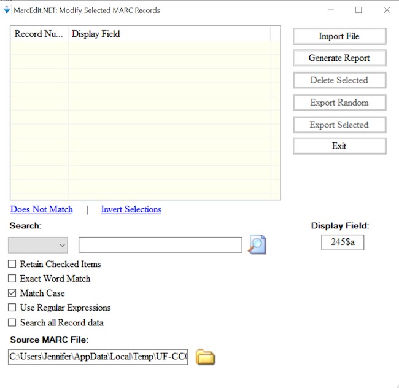

::::::::::::::::::::::::::::::::::::::: objectives

- Explain Build New Field, RDA Helper and Select Records for Edit advanced functions

::::::::::::::::::::::::::::::::::::::::::::::::::

:::::::::::::::::::::::::::::::::::::::: questions

- How can Build New Field be used to combine elements from existing MARC fields into a new field?
- How can the RDA Helper be used?
- How can Select Records for Edit be used to manipulate a subset of your MARC file?

::::::::::::::::::::::::::::::::::::::::::::::::::

## Building a MARC field

:::::::::::::::::::::::::::::::::::::::::  callout

Sometimes it is necessary to create a new MARC field based on the content of existing MARC fields.
This is possible using the function called, Build New Field.

{alt='Build New Field Window'}

::::::::::::::::::::::::::::::::::::::::::::::::::

:::::::::::::::::::::::::::::::::::::::  checklist

## Let's build a new `035 9\$a` using the data from the 001 and static data

1. Go to Tools → Build New Field
2. In the new window, in the field box, type in `=035  9\$a(LCMarcEdit){001}`
3. Select the box to "Always add this field"
4. Click Process
  

::::::::::::::::::::::::::::::::::::::::::::::::::

:::::::::::::::::::::::::::::::::::::::  challenge

## Use the Build New Field to add a proxy to the `856$u`

1. For eResources, it is sometimes necessary to add your institution's proxy information to the url in the `856$u`. Add `https://exampleproxy.edu/login?url=` prefix to the url in the `856$u`.

:::::::::::::::  solution

## Solution

1. Go to Tools → Build New Field
2. In the new window, in the field box, type in `=856  40\$uhttps://exampleproxy.edu/login?url={856$u}`
3. Select the box to "Replace Existing Field"
4. Click Process
  
:::::::::::::::::::::::::

::::::::::::::::::::::::::::::::::::::::::::::::::

## RDA Helper

Records aren't created equal in that we encounter MARC data that follows different descriptive cataloging standards. There are a number of records cataloged according to the AACR2 standard or even AACR or earlier. Sometimes it is necessary to make sure these records follow the current RDA descriptive cataloging standard. MarcEdit lets you do this through the function called RDA Helper.

To run the RDA Helper, go to Tools and select RDA Helper. In the window that opens, you can pick and choose how you would like to transform your records to align better with the RDA descriptive standard. For example, you can add the RDA fields 336, 337, and 338 for content, media, and carrier types. You can update the MARC field 040 to include the `$e` rda and delete the GMD statement. You can also evaluate the 260/264.

{alt='MarcEdit RDA Helper'}

:::::::::::::::::::::::::::::::::::::::  challenge

## Run the RDA Helper on your MARC data

1. Run the RDA Helper with these settings: Add 336, 337, 338; Modify the 040; Evaluate the 260/264; Always use the copyright symbol; Expand abbreviations; Remove the GMD.

:::::::::::::::  solution

## Solution

1. Go to Tools in the upper menu in the MarcEditor
2. Select RDA Helper
3. Check off the settings listed above
4. Click the OK button.
5. Check your MARC data. Do you see the changes?
  
:::::::::::::::::::::::::

::::::::::::::::::::::::::::::::::::::::::::::::::

## Select Records to Edit

There are times when you need to work on a subset of your MARC data. The Select Records for Edit function allows you do this.

Before using the Select Records for Edit function, save your file to capture recent edits.

Go to File and click on Select Records for Edit. In the window, you will see Display Field in the lower right hand corner. This is where you enter the MARC field you want to see displayed once you import your file. You can enter a MARC field and subfield or just a MARC field. The MARC field and/or subfield that you add in this box will provide the criteria you need to select records you want to edit. Once you have entered the Display Field, click on Import File. This will import the MARC (`.mrk`) file that you are currently working on. You can select another MARC (`.mrk`) file in the box Source MARC file.

{alt='MarcEdit empty Select Records for Edit dialog'}

To select only the records you want to edit, enter your criteria in the Search box and click the magnifying glass icon. Records in your file where the contents of the selected Display Field match your search criteria will be selected. Click on Export Selected to export these records and edit them. 

{alt='MarcEdit completed Select Records for Edit dialog'}

When saving the exported records you can choose to save the file as a new record subset (Save As), or merge the edits back into your complete record set (Save). 

:::::::::::::::::::::::::::::::::::::::  checklist

## Let's add cutters to call numbers in the 099

1. Go to File → Select Records to Edit
2. In the new window, type in `099$b` in the Field Display
3. Click on Import File
4. In the search box, type in "Display field not found" to locate all records missing `099$b`
5. Click the magnifying glass icon. A pop up window will indicate the number of records selected that match your criteria. Click OK.
6. Click on Export Selected. A pop up window indicate that your selected records have been extracted. Click OK.
7. A new MarcEditor window will open. Note the temporary file name at the top of the editor window indicating this file is distinct from your main file. In the new MarcEditor, go to Tools → Call Number tools → Cuttering Tools → Generate Cutters.
8. In the field box enter 099 and click Process
9. Check your results by using Find All `=099`
10. Select File → Save. A pop up window will indicate your extracted data with edits has been saved back into your main file. Click OK.
  

::::::::::::::::::::::::::::::::::::::::::::::::::

:::::::::::::::::::::::::::::::::::::::: keypoints

- Advanced reports and functions are available in MarcEdit to apply global and selective edits
- MarcEdit comes with an array of tools to manipulate data and validate MARC.

::::::::::::::::::::::::::::::::::::::::::::::::::

